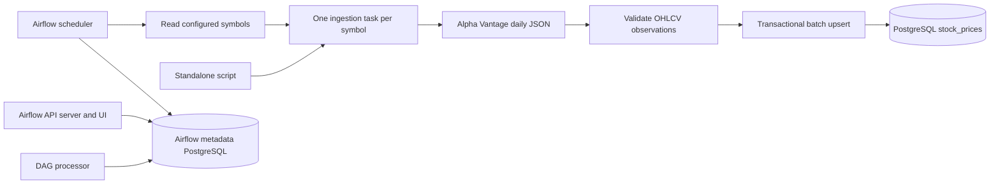

# Architecture

## Data flow

The standalone script calls the same Python ingestion function; it does not need Airflow to execute. The diagram groups the HTTP, parsing, and database steps inside a symbol task. Those steps are separate Python functions, not separate Airflow tasks.

## Runtime

Airflow 3.3.1 runs on Python 3.12 with LocalExecutor. The API server, scheduler, and DAG processor use the same project image. A one-shot initialization service migrates Airflow metadata, creates the application table if absent, and writes the UI account file before long-running services start.

Two PostgreSQL 16 containers separate Airflow metadata from application records. This adds a lightweight database service but makes ownership, reset boundaries, and inspection straightforward. PostgreSQL is pinned to major version 16 to receive compatible patch releases; Airflow and Python libraries are pinned more narrowly.

The scheduler launches local task processes. No broker, Celery worker, or triggerer is needed for this DAG. Parallelism is bounded, the DAG permits one active run, and mapped symbol tasks execute one at a time. This protects a small free API allowance; it is not a distributed global quota manager.

## Module boundaries

| Module | Responsibility |
| --- | --- |
| `config.py` | Validate environment values and normalize symbols. |
| `api.py` | One HTTP attempt, timeouts, status/body error classification, Retry-After handling. |
| `parsing.py` | Validate source records and create typed observations. |
| `database.py` | Open bounded connections and perform atomic batch upserts. |
| `pipeline.py` | Coordinate fetch, parse, persist, and return a small summary. |
| `cli.py` | Process configured symbols with bounded standalone retries and a meaningful exit code. |
| `dags/stock_market_pipeline.py` | Daily scheduling, mapped tasks, and Airflow retry/failure semantics. |

The DAG imports no application code that opens external connections. It reads symbols during task execution. Only compact summaries pass through XCom; raw payloads are not persisted in Airflow metadata.

## Persistence and replay

The key is `(symbol, trading_date)`. It also supports queries for one symbol ordered by date without an extra index. Prices use `NUMERIC(20,8)`, volume uses `BIGINT`, and the source trading date uses `DATE`. Validation rejects values that cannot be represented faithfully.

One symbol's valid observations are written in a single transaction using parameterized batch inserts. `ON CONFLICT DO UPDATE` accepts corrections. A distinctness condition prevents needless updates of unchanged observations, including their audit timestamp. The affected count combines inserts and corrections; it does not pretend to distinguish them.

A database error rolls back the entire symbol transaction. Other symbols' previously committed transactions are unaffected. Initialization uses `CREATE TABLE IF NOT EXISTS`; it does not silently migrate an incompatible existing table. Future schema changes require an explicit migration.

## Schedule and retry ownership

The DAG runs daily at 02:00 UTC with catchup disabled and a fixed UTC start date. The first scheduled run occurs according to Airflow's interval scheduling; reviewers can trigger it manually immediately. A new DAG is unpaused by default.

The HTTP layer makes exactly one attempt. In Airflow, transient exceptions cause at most two retries, five minutes apart. A provider cooldown up to five minutes is therefore respected. A longer cooldown or an explicit daily-quota response fails the run with an actionable message instead of burning requests.

The standalone script makes at most three attempts per symbol, waiting 30 then 60 seconds, or longer when a supported Retry-After value requires it. It continues to other symbols after failure and exits nonzero if any symbol failed. Do not run the standalone script concurrently with the DAG when sharing a limited API key.

Every HTTP attempt is preceded by the configured minimum interval. This provides conservative pacing in the serialized workflow, not accounting for requests from other applications or manual runs.

## Missing and invalid data

Invalid individual records are skipped with rejection counts and reasons. Valid records remain eligible for storage. An empty series, missing/mismatched symbol metadata, or a series with zero valid records fails the symbol task. Missing prices never become zero.

A valid response containing only previously stored observations succeeds with unchanged rows. The pipeline does not infer market sessions, fabricate weekend records, or guarantee that the provider has published the most recent session by 02:00 UTC. A later run can ingest delayed publication or corrections.

## Configuration and credentials

Compose supplies environment variables. API requests use a fixed HTTPS endpoint and do not follow redirects. Database parameters are passed separately to the driver; the Airflow metadata URL is URL-encoded by a helper consumed through Airflow's configuration command.

The UI uses Airflow's Simple Auth Manager with an account file initialized from environment variables. The UI port binds to loopback; database ports are not published. This is a local assessment deployment. Named volumes persist databases, logs, and the UI account file. The image excludes `.env`.

## Capacity and extensions

Current storage work is bounded by the compact endpoint response for each symbol. Batch writes and an indexed natural key handle this workload efficiently. Increasing symbols requires no code changes, but the provider quota must cover symbols plus retries and manual runs.

If requirements grow, first establish a shared API request budget, then consider higher task concurrency and an executor suited to multiple hosts. Full historical ingestion would require a different API entitlement and an explicit backfill design. These capabilities are outside the MVP.

## Verification boundaries

Unit tests exercise validation and failure decisions. Integration tests use a separate ephemeral PostgreSQL database to verify actual SQL behavior. The Airflow test imports the real DAG inside the project image. A successful live-provider run is a separate acceptance step recorded in `VERIFICATION.md`.

## References

- [Airflow Docker deployment](https://airflow.apache.org/docs/apache-airflow/3.3.1/howto/docker-compose/index.html)
- [Airflow LocalExecutor](https://airflow.apache.org/docs/apache-airflow/3.3.1/core-concepts/executor/local.html)
- [Airflow Simple Auth Manager](https://airflow.apache.org/docs/apache-airflow/3.3.1/core-concepts/auth-manager/simple/index.html)
- [Alpha Vantage daily endpoint](https://www.alphavantage.co/documentation/#daily)
- [PostgreSQL INSERT and ON CONFLICT](https://www.postgresql.org/docs/16/sql-insert.html)
